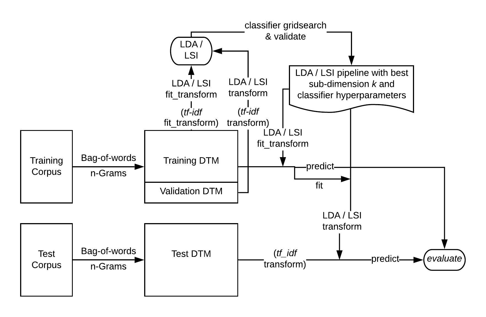

# LDA-Encoder-for-Text-Classification

[](https://www.codacy.com/manual/kunyuhe/Dimensionality-Reduction-for-Text-Classification-with-LDA?utm_source=github.com&amp;utm_medium=referral&amp;utm_content=KunyuHe/Dimensionality-Reduction-for-Text-Classification-with-LDA&amp;utm_campaign=Badge_Grade)
[](https://codeclimate.com/github/KunyuHe/Dimensionality-Reduction-for-Text-Classification-with-LDA/maintainability)
[](https://opensource.org/licenses/MIT)

The curse of dimensionality is not rare for text classification tasks, and overfitting can be a direct result. This project attempts to incorporate a topic modeling technique, Latent Dirichlet Allocation (LDA), as a preprocessing step in the classification pipeline to address the issue. Using extracted topic distributions as encoding vectors, each document is represented as a linear combination of the latent topics. Empirical results show that although incorporating LDA might harms model performance, it can help reduce training time and address overfitting significantly.

This project incorporates LDA as the dimensionality reduction step in text classification pipelines. It also compares the empirical result pipelines that only apply `tf-idf` rescaling. The workflow for using LDA or Latent Semantic Indexing (LSI, or LSA) for dimensionality reduction is described in the figure below.



A comprehensive introduction to this project can be found at [`./report.pdf`](https://github.com/KunyuHe/Dimensionality-Reduction-for-Text-Classification-with-LDA/blob/master/report.pdf).


## Getting Started

Follow the instructions to get a copy of the project up and running on your local machine for development and testing purposes.

### Dependencies

First, navigate to a location on your machine to put this project, and run:

```
git clone https://github.com/KunyuHe/Latent-Dirichlet-Allocation-Dimensionality-Reduction.git
cd Latent-Dirichlet-Allocation-Dimensionality-Reduction
```

Follow the instructions below to install the dependencies.

#### Conda

Personally I prefer `conda` over `pip`, so I would suggest creating a `conda` virtual environment to host the dependencies with the following command (make sure you have installed `conda` and added it to the PATH beforehand):

```console
conda env create -f environment.yml
```

#### Pip

You can also use `pip` (make sure you've installed `python` with `pip` beforehand). First, navigate to the root directory of this project and run the following in console to create a virtual environment, and activate it:

```
python -m venv env
.\env\Scripts\activate
```

Then, run the following codes to install all the dependencies with `pip`.

```
pip install --user -r requirements.txt
```

### Data

We use a dataset of 50,000 movie reviews from the IMDb (Internet Movie Datbase) website collected
by Andrew Maas (Maas et al., 2011). Each review in the dataset is labeled "positive" or "negative"
according to its rating of the movie from 1 to 10. Reviews with a score of 6 or higher are labeled as
positive. Half of the dataset is used as training set and the other half as test set. Both are perfectly
balanced. Our goal is to build a text classification pipeline that distinguish positive reviews from
negative ones. The classifier should generalize well enough on unseen movie reviews and tag them
with correct sentiment labels.

To get the data, please navigate to `data/`, and download the dataset into this folder at: https://ai.stanford.edu/~amaas/data/sentiment/aclImdb_v1.tar.gz 

After downloading, please unzip the archive, and replace all the duplicate files.

Since this project use `spacy` for text preprocessing, lemmatization in specific, we need to download `en_core_web_sm`.

```
python -m spacy download en_core_web_sm
```

## Run the Program

Please follow the instructions below to run the program:

1. Navigate to `codes/` directory that holds all the scripts.

   ```
   cd codes
   ```

   

2. Clean the text data and prepare it for our classification pipeline by transforming the documents into a document-term-matrix (DTM), save it in `../data/clean/subset_1250` with:

   ```
   python clean.py --train_size=1250
   ```

   Here `--train_size=` is an argument used to specify the training size. We have 25000 training documents. To speed up the testing process, we train our program on 1250 movie reviews and test on the rest.

   To see what other arguments are available, use:

    ```
   python clean.py -h
    ```

   As we applied lemmatization and used bi-gram transformation, it can still take a while for test data transformation.

   

3. This project allows two dimensionality reduction preprocessing step for text data, namely, LDA and LSI. It also compares the performance of classification pipelines with them with that of those without.

   To run LDA on the training DTM we just created, use cross validation to find the best number of latent topics to extract, and log the training and test performances of a tuned Logistic Regression model, we can run the following: 

   ```
   python lda.py --train_size=1250
   ```

   To run the same analysis with LSI, use the script `lsi.py`. To go without dimensionality reduction, use `tf_idf.py`.


## Authors

- **Kunyu He**, The University of Chicago, CAPP'20

See also the list of [contributors](https://github.com/KunyuHe/Dimensionality-Reduction-for-Text-Classification-with-LDA/contributors) who participated in this project.


## License

The package is released under the [MIT License](LICENSE).


## Acknowledgments

- Thanks to [Parth Khare](https://github.com/parthkhare) for participating and contributing the [extended list of stopwords](https://github.com/KunyuHe/Dimensionality-Reduction-for-Text-Classification-with-LDA/blob/master/data/extended_stopwords.txt).
